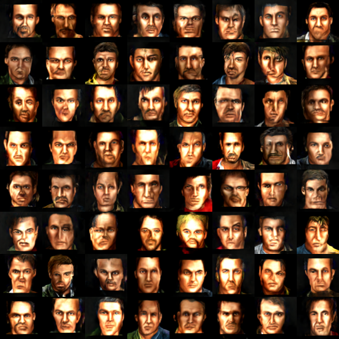
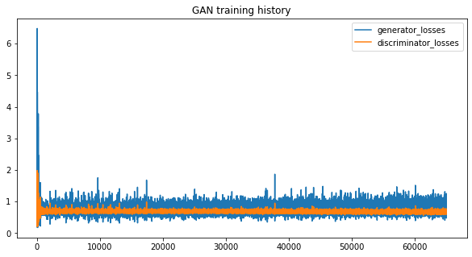
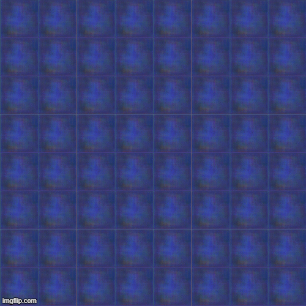

# Ja2_Faces_Generation

## Overview
The goal of this project is to generate faces using the <b>Generative Adversarial Network</b> based on the original photos of the mercenaries from game <b>Jagged Alliance 2</b>. I used <b>Google Colab</b> to training models. I interupt training after <b>65000</b> epochs, when I didn't see any future progress.

## Data
Images come from the game <b>Jagged Alliance 2 version 1.13</b> [https://jagged-alliance.pl/download72](https://jagged-alliance.pl/download72)

## Images Exctraction 
To extract orginal mercenaries faces from this game you need:
* Unpack <b>Faces.slf</b> file (located in the main game data folder) using <b>SLFExplore</b> program [http://ironsquad.pl/plik15/](http://ironsquad.pl/plik15/)
* Convert all <b>sti files</b> to png. I writed script <b><i>convert_sti_to_png.py</i></b> using the [https://github.com/ja2-stracciatella/ja2-open-toolset/tree/master/ja2py](https://github.com/ja2-stracciatella/ja2-open-toolset/tree/master/ja2py) library to do this.
* Extract <i><b>0.png</b></i> files from each mercenary folder and give them unique names. I writed script <i><b>unpack images</b></i> to do this.

I enclosed all above scripts in <b>Scripts</b> directory.


## GAN Architecture

<b> GENERATOR </b>
```
_________________________________________________________________
Layer (type)                 Output Shape              Param #   
=================================================================
dense_1 (Dense)              (None, 147456)            14893056  
_________________________________________________________________
reshape (Reshape)            (None, 24, 24, 256)       0         
_________________________________________________________________
up_sampling2d (UpSampling2D) (None, 48, 48, 256)       0         
_________________________________________________________________
conv2d_2 (Conv2D)            (None, 48, 48, 256)       590080    
_________________________________________________________________
batch_normalization (BatchNo (None, 48, 48, 256)       1024      
_________________________________________________________________
activation (Activation)      (None, 48, 48, 256)       0         
_________________________________________________________________
up_sampling2d_1 (UpSampling2 (None, 96, 96, 256)       0         
_________________________________________________________________
conv2d_3 (Conv2D)            (None, 96, 96, 256)       590080    
_________________________________________________________________
batch_normalization_1 (Batch (None, 96, 96, 256)       1024      
_________________________________________________________________
activation_1 (Activation)    (None, 96, 96, 256)       0         
_________________________________________________________________
conv2d_4 (Conv2D)            (None, 96, 96, 3)         6915      
_________________________________________________________________
activation_2 (Activation)    (None, 96, 96, 3)         0         
=================================================================
Total params: 16,082,179
Trainable params: 16,081,155
Non-trainable params: 1,024
_________________________________________________________________
```

<b> DISCRIMINATOR </b>
```
_________________________________________________________________
Layer (type)                 Output Shape              Param #   
=================================================================
conv2d (Conv2D)              (None, 48, 48, 128)       3584      
_________________________________________________________________
leaky_re_lu (LeakyReLU)      (None, 48, 48, 128)       0         
_________________________________________________________________
dropout (Dropout)            (None, 48, 48, 128)       0         
_________________________________________________________________
conv2d_1 (Conv2D)            (None, 48, 48, 256)       295168    
_________________________________________________________________
leaky_re_lu_1 (LeakyReLU)    (None, 48, 48, 256)       0         
_________________________________________________________________
dropout_1 (Dropout)          (None, 48, 48, 256)       0         
_________________________________________________________________
flatten (Flatten)            (None, 589824)            0         
_________________________________________________________________
dense (Dense)                (None, 1)                 589825    
=================================================================
Total params: 888,577
Trainable params: 888,577
Non-trainable params: 0
_________________________________________________________________
_________________________________________________________________
```

## Dependencies
* Python 3.7
* Numpy
* Matplotlib
* TensorFlow 2.0 GPU Version
* Pillow
* SLF Explore (for unpacking slf files)
* Ja2py (for convert sti files)

## Final generated images after 65000 epochs


<i> The generated faces are quite realistic to me. Notice that I only used 130 good quality image to training. </i>

## Training history


<i> As you can see after several dozen epochs, the loss of the generator and discriminator stabilized, but the quality of images continued to increase. </i>

## GAN learning progress as a GIF


